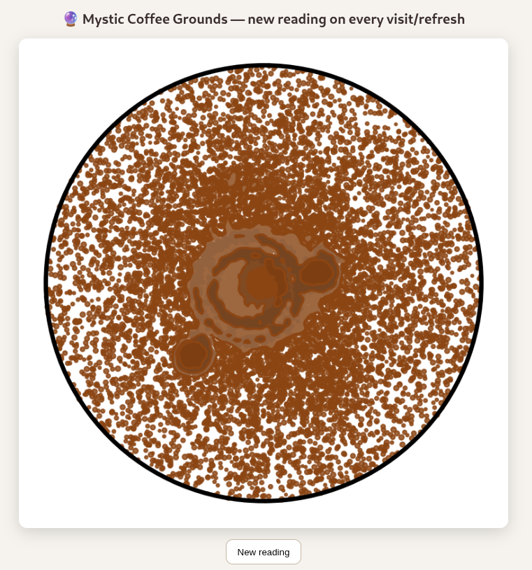

# Digital Coffe Grounds

A digital script to let you read in coffee grounds. 
Was initially just a joke but can now be deployed as a docker-container



## Docker
```bash
docker build -t mystic-coffee .
docker run --rm -p 5000:5000 mystic-coffee
```

## AI notice
This was my first test in generating a (not serious) python project with ChatGPT 5.0 so most if not all of this was AI generated. I find it alarming on how easy this was and that it works at all, so I guess I am now a vibe coder? O.o

